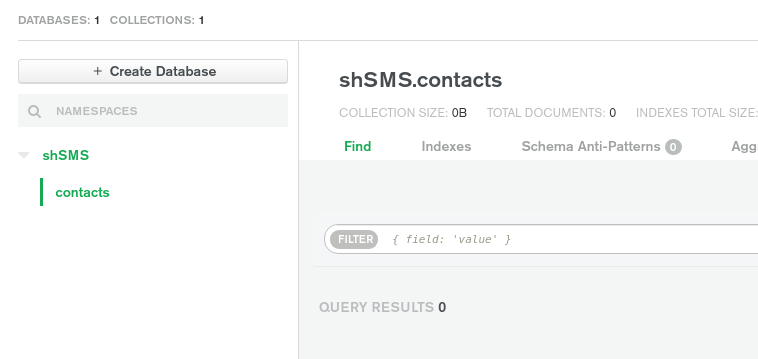

# 02. mLab \(MongoDB\)

In this section we are going to set up our MongoDB database so we can have a place to store all our messages.

1. Go to [mlab.com](https://mlab.com) and click the "Sign Up" button near the top of the screen. 
2. Fill out the form to create an account/verify your email 
3. Once verified, you'll be asked to fill out a short form about how you intend to use the service, I just put "Learn MongoDB", "Personalization" and "Javascript" 
4. The next page should be your product selection. Choose the free one. 
5. You'll be presented with some options to configure your database. Notice your server options are Amazon, Google or Microsoft...wonderful. I'm going to stick with Amazon, fuck it. I'm also going to rename my cluster from `Cluster0` to `shsms-cluster` just because. 
6. Click the "Create Cluster" button and wait a few minutes for the site to do it's thing.

Doing good so far? That last step should take about a minute or two. Next we'll set up our database to connect to our server on Heroku

1. On dashboard you will see a button that says "Connect" click that to open a dialog 
2. You should be in the section "Add your current IP Address" when the dialog opens. In the two textfields near the bottom, enter a username/password.  

   **Note:** This should not be the username/password you signed up to mLab with. This user will be the administrator of the database. I'll make my username `shSMS-admin`  

3. Click "Create Database User" 
4. Now click the "Allow Access from Anywhere" button in the dialog 
5. The "IP Address" field should already be filled out with `0.0.0.0/0`. Click "Add IP Address"

_"**WHOOOOAAAAAAHHH** hol' up bruh!"_ Why the eff are we allowing access from anywhere?? Good question! BUT! We're just going to do this for now because we're using Heroku to host the server and the server needs to hit this database allll the time and who knows what IP address/port Heroku is gonna give our app. I will say, I haven't actually checked the IP address that Heroku dishes out, but I do know for certain that the port is different/random every time the app starts up so why would they bother giving us a static IP. Don't worry too hard though, once we set up our own server/vps we'll be able to control the IP/port and limit access to our database so only we can connect, buuuut until then...."_Abandon hope all ye blah blah whatever_"

1. Click "Choose a connection Method" 
2. Choose "Connect Your Application" 
3. All we want from here is the URI they give us. We're going to take that and throw it in our server `.env`file after we make a few changes so copy/paste this somewhere for now.  

   `mongodb+srv://shSMS-admin:<password>@shsms-cluster.lq31i.mongodb.net/myFirstDatabase?retryWrites=true&w=majority`  

4. On the Dashboard, click the button that says "Browse Collections" 
5. Click "Add My Own Data" 
6. In the dialog that pops up, enter a name for your database and a name for your first collection. I'm going to name my database name `shSMS` and my collection name `contacts` because shSMS uses that anyway so we may as well save it a step when it loads.  

   **Note:** You can think of a collection like a folder in your database. Or a directory/path. shSMS will automatically create four collections if they aren't already there \(contacts, messages, settings and media\). Any other collections in your database will be ignored.  

7. You should now see something like this

   

And that should be it for setting up mLab! You can come back to this page in mLab if you want/need to manually edit/delete the data at any time. Now we can set up our Heroku account!

