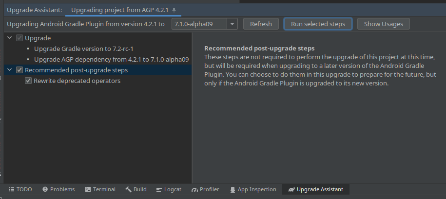
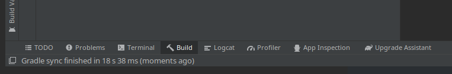
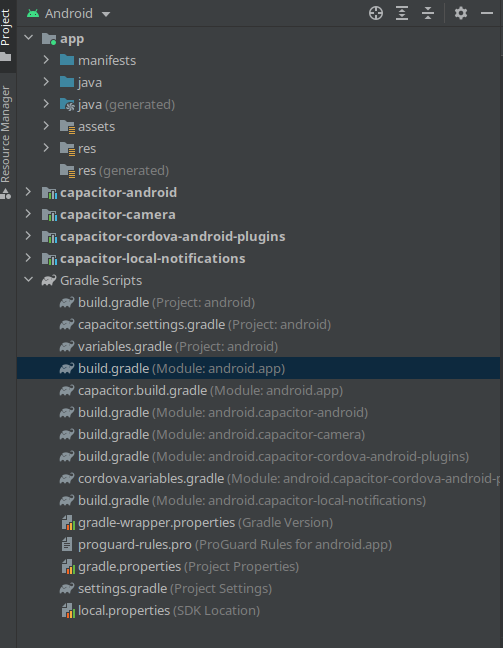
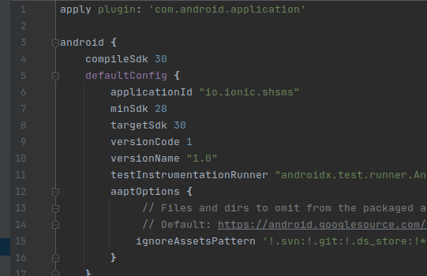
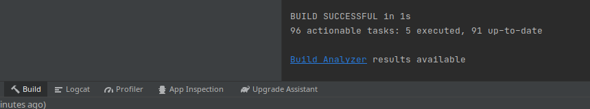

# 09.2 Build APK \(with Android Studio\)

1. Open the project in Android Studio  `File > Open` 
2. Select the `android` folder in the frontend folder and open it. 
3. Wait for _everything_ to load. If prompted to upgrade the gradle, **upgrade the gradle**

4. Click `Build` in the top menu and select `Make Project`  
  
I like to open the Build logs and watch what's happening, but it's optional

If everything worked and you see `Build Succeeded!` in the log, skip down to step 5. Otherwise, read on, it should be a simple fix!  
  
If you get an error like:   
  
`Cause: compileSdkVersion is not specified. Please add it to build.gradle`

Don't fret! Just expand the `Gradle Scripts` folder in the file-tree on the left hand side and double click the file `build.gradle (Module: android.app)`

In the code window on the right hand side, we need to change three things: `compileSdk`, `minSdk` and `targetSdk`. Edit the file so it looks like this:

Save `Ctrl + S` and try to build again. `Build > Make Project`

If you see something like this, you're all good!

5. Now go to `Build > Build Bundle(s)/APK(s) > Build APK(s)`

Your APK should build and an alert should appear in the corner giving you the option to open the folder where the APK was compiled. In that folder you should see `app-debug.apk` and an `output-metadata.json` file.

YAAASSSSSSSSSSS!!! 🎉🎉💃 Great Success!! Now just get that thing on your device and we're golden!

**Note:** I believe the error situation above is caused by something not being set in a config file, but I haven't been able to narrow down exactly what it is. Please know that I am working on that. But once you've done it once it should be set for good unless you delete the project and re-clone the repo. And as a bonus, now that it's all set up here, you can build from the terminal too with one simple command:  
  
`./gradlew assembleDebug`

**Note 02:** I added the `android` folder to the main branch of the repo so the issue mentioned above \(hopefully\) should not happen anymore and Android Studio should have the correct information.

