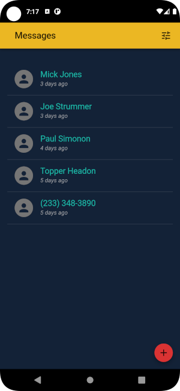
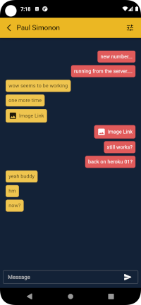

## shSMS
#### Self Hosted Short Message Service


---

An app designed to run natively on the Android operating system and allow you to communicate via SMS.

Please note: This app makes several assumptions about you as a user. First and formost, it assumes you are following the steps Chapter Two (p.33) of Michael Bazzell's Book "Extreme Privacy: What It Takes To Dissapear (Third Edition)". By that assumption, it is assumed that you have a Google Pixel device running GrapheneOS, a Twilio account with at least one phone number and access to a computer with Linux installed.

### What this app is not:
   * shSMS is NOT an end to end encrypted messaging service. Yes, the messages are stored on your personal database and you have full control over those, but the person you're communicating with, (presumably) is using a standard mobile device with a "traditional" cellular service provider, ie: AT&T, Verizon, etc. There is absolutely nothing that can be done to stop those providers from storing your data. Just a fact of life we all have to deal with.

   * shSMS is not intended to be 100% private, even on your end (depending on how you host). Your messages go through Twilio. You can delete them, but still, they must go through Twilio servers at some point in order to get to you. Think of it as a tool to help you stay more _anonymous_
   
   * If you choose to host your server on Heroku: Heroku is now owned by SalesForce. SalesForce is a beast when it comes to data. Assume they have _everything_ that comes through their servers and are using it.
   
   * If you choose to host your database on mLab (mongodb) your data is also in their hands. We can encrypt our entries before they go in to the database (coming soon), but the fact remains that even though we're "self-hosting" away from the major providers, we're still depending on someone else to hold our information.

### Now tell me what it can do
   * Send and receive SMS (text messages) with people who are using a standard mobile device.
   * Send and receive MMS (Multimedia Messaging Service) with people who are using a standard mobile device. 
   * Recieve push notifications when a new message is received. An alert will show and the device will vibrate and/or chime when a new message is recieved just like you would expect without any Google services.
   * Run on any computer locally (not hosted publically on the internet) and have the same functionality as the native Android app with updates in real-time.

  

---

## Installation
---

#### Installation on GrapheneOS Device

There are a few ways to go about this, to start off, I'll go through the method I use and add other methods over time.

Here we go...

1. Create a directory on your computer to hold the two repos. When we're all done we will have a folder (shSMS) with two folders inside (shsms-frontend and shsms-backend)

   `mkdir shSMS && cd shSMS`

2. Clone the frontend repo

   `git clone https://github.com/pywkt/shsms-frontend.git`

3. Navigate to the directory we just created

   `cd shsms-frontend`

4. Install frontend dependencies

   `npm install`

5. Create a file to hold our environmental variables. These will be specific to your own personal build and will only be hosted on your machine. 

   `touch .env`

6. Open the .env file you just created and add the following, **be sure to update these with your own information**

**Note**: Files that begin with "." are hidden by default on many machines. You may need to change your display settings on your operating system to see them in the folder.

Personally, I prefer to just do it all in the terminal because we're already in there, why bother with all that double-clicking 🤷‍♀

Using the terminal:
   * `nano .env`
   * Copy/Paste the sample below
   * Change the values to match your own info
   * `Ctrl + O` (save changes)
   * `Enter` (confirm that you want to overwrite the file)
   * `Ctrl + X` (exit the Nano text editor)
   * `cat .env` (print the file to the screen and make sure your changes are correct and saved)
   * `clear` (clear the terminal in case some shady characters walk past you and want to peek at your screen)

Do not use any kind of quotes/spaces/parenthesis around the values after the equal (=) sign

Values to add to the .env file:
  ```
  REACT_APP_TWILIO_PHONE_NUMBER - The Twilio number you want to use for sending/recieving messages

  REACT_APP_KEY_HASH - Any "password" unique to you. This is used as validation in the requests to the server and will be used in several places.

  REACT_APP_SMS_SERVER_URL - The URL to where you will be hosting your server. If using Heroku, add the root path to your app. If self hosting (personal server/raspberry pi/vps/etc), add the location and port. eg: https://281.23.98.102:4001
  ```

Your final .env should look something like this:
```env
REACT_APP_TWILIO_PHONE_NUMBER=+12345678900
REACT_APP_KEY_HASH=THIS_IS_YOUR_SECRET_KEY_IT_CAN_BE_ANYTHING
REACT_APP_SMS_SERVER_URL=https://cool-heroku-project-01.herokuapp.com
```

From here (if you've already set up the backend) you should be able to run the frontend locally on your machine with no issues.

To do so:
1. Make sure you are in the main frontend folder in your terminal (shSMS/shsms-frontend) and type

   `npm start`

2. Once the terminal says _"You can now view shsms in the browser."_, open a browser and navigate to `localhost:3000` and you should see the app running.

3. Send your Twilio number an SMS from a different number and watch in amazement.

Protip: I like to either make the browser window smaller or open dev-tools and set it to the size of a phone so the messages aren't as spread out on the screen. This is intended to be a mobile app after all.

**Congratulations!** You've set up the local web version, but that's probably not why you came here is it? Let's take a breather and get on that Android APK I mentioned earlier...

---

Still with me? Cool, pretty straight-forward so far. Now the fun part...
Before we can build the APK, we need to set up the Android SDK on our machine.

We're still in the root of our frontend folder (shSMS/shsms-frontend)

1. Add Android to the project

   `npx cap add android`

I'm going to present two ways to get the SDK on your computer. Both have their pros and cons. I reccommend starting with the terminal based method first just because Android Studio is a pain in the ass sometimes and we don't really need it for anything other than installing the SDK on our machine. But the choice is yours...

#### Installing Android SDK (without Android Studio)
1. Open a new terminal window and Download the Android Command Line Tools zip file for Linux. I'm going to save it in my Downloads folder (~/Downloads)
At the time of writing this 'commandlinetools-linux-7583922_latest.zip' is the latest version. You may need to update the commands to match whatever version you download

   https://developer.android.com/studio#command-tools

2. I prefer to keep my SDK in an Android folder in my home folder, but it's up to you where you keep it, just remember where it is because we'll need to reference it in a minute.

   `cd ~ && mkdir Android && cd Android`

3. Move the zip in to this folder, unzip the contents, delete the zip file, open the folder 'cmdline-tools', make a folder called 'tools' and move everything in to the newly created 'tools' folder

   The next command looks like a lot, but it's just because I tried to make this as simple as possible by giving you a single one-liner chain of commands. Don't forget to replace the name of the zip file if yours is different.

   `mv ~/Downloads/commandlinetools-linux-7583922_latest.zip ./ && unzip commandlinetools-linux-7583922_latest.zip && rm commandlinetools-linux-7583922_latest.zip && cd cmdline-tools && mkdir tools && mv -i * tools`

   That warning at the end kinda scared us, let's just get some re-assurance and make sure everything went as planned

   `ls tools`

    You should see the folders `bin` and `lib` and then a few other files in there. Good stuff.

4. The next step will vary depending on what shell your terminal is using. If you're not sure what that means, you're probably using BASH, but let's double check anyway

   `echo $SHELL`

    You will probably see something like `/usr/bin/bash` or `/usr/bin/zsh`

5. If you're using bash, we'll need to edit `.bash_profile`. If you're using zsh you've probably got `.zshrc`

   `nano ~/.bash_profile`

6. At the end of the file add the following

    ```env
    export ANDROID_HOME=$HOME/Android
    export PATH=$ANDROID_HOME/cmdline-tools/tools/bin/:$PATH
    export PATH=$ANDROID_HOME/emulator/:$PATH
    export PATH=$ANDROID_HOME/platform-tools/:$PATH
    ```

    See what we did there? We're setting the "home" directory for our Android stuff to `~/Android` and telling it where our command line tools stuff is located.

7. Save (`Ctrl + O`, `Enter`) and exit (`Ctrl + X`)

8. Close your terminal window and open a new one

9. Check to see if sdkmanager installed correctly. You might see something like "picked up _JAVA_OPTIONS: etc" and underneath it on the last line printed will be a version number. If so, we're good.

   `sdkmanager --version`

10. Install the SDK. At the time of writing this, shSMS is looking for at least 27, so let's do 30 because yolo.

   `sdkmanager --install "platform-tools" "platforms;android-30" "build-tools;30.0.3" "emulator"`

#### Installing Android SDK (Android Studio)
The _"easiest"_ way to get the android sdk on your system is to install Android Studio. 
Another benefit to this method is that it allows you to run the app in an emulator before deploying to your device.

Note: "easiest" is in quotes because, yes, it is pretty simple because installing Android Studio will automatically install the Android SDK and you can keep it up to date by clicking a few buttons, but Android Studio is fairly large and once set up, there's a decent chance you won't be using it regularly unless you really want to play around with the Android-specific parts of the code, which in that case you probably already have it installed. But anyway, we're going to use it because it gives us a 'wizard' style setup and then we should be good to compile from the terminal.

First, make sure you have all the required libraries installed on your system.

Debian
`sudo apt-get install libc6:i386 libncurses5:i386 libstdc++6:i386 lib32z1 libbz2-1.0:i386`

1. To download Android Studio, navigate to https://developer.android.com/studio#downloads and download the version for Linux

2. Unzip the file to a location you'd prefer, I just keep mine in the Downloads folder because that's how I did it the first time and I just stuck with that for whatever reason.

3. Once unzipped, in the terminal, navigate to the `bin` folder in the directory you created. For me it's 

   `cd ~/Dowloads/android-studio/bin`

4. Open Android Studio by running

   `./studio.sh`

5. Go through the setup and make note of where you install the Android SDK, we will need this path in a minute. I installed my SDK in my home (~) directory. So it's `/home/<username>/Android/sdk`.

We did it. We're sooooo close now

1. Navigate back to the root of the frontend folder (shSMS/shsms-frontend)

2. Make sure you have 

3. Build the app and sync with some Android stuff

   `npm run build && npx cap sync android`

   If that last command gave you an error that mentions Java or JDK or something along those lines, try downloading JDK 8. I'm not anything close to an expert on anything Java, but this worked for me every time when testing on different devices.

   `sudo apt-get install oracle-java8-installer` (Debian)
   `sudo pacman -S jdk8-openjdk` (Arch/Manjaro)

4. Navigate to the 'android' folder

   `cd android`

5. Build the APK

   `./gradlew assembleDebug`

6. Navigate to where the APK was saved

   `cd app/build/outputs/apk/debug`

7. Make sure your APK is there

   `ll` (lists the files in the current directory)

Do you see `app-debug.apk`? If so **_CONGRATULATIONS!_** 🎉

8. We're going to download this directly to our phone now, but we need to get our local ip address

   `ip a | grep inet` or `ip a | grep 192.168.` 
   
   Note: if you see a "/24" or "/16" after the local ip address you can ignore it. We just want the "192.168.X.XXX"

9. In your terminal start a simple python server

   `python3 -m http.server`

10. On your GrapheneOS device, open a web browser and go to your local ip address

11. The files in that directory should be listed.

12. Click the .apk to download it.

13. Open/install the .apk

14. Close the browser, swipe up or whatever and you should now see shSMS in with all your other sweet Google-free-open-source apps.

Can you believe it?? You've got some top-notch patience if you made it all the way here, but it's totally worth it! You just added another layer between you and the data-controlling 'man'. These text messages belong to you and you should have the right to choose who sees them. So pat yourself on the back and grab a snack because you deserve it...

Unless you did this part first, then you've still got to set up the server, but trust me, it's waayyyyyy easier/faster. Like, all you have to do is make a few accounts, clone, add env variables and push it to Heroku or whatever server you want to use.

### To-Do:
   * Ability to select from native contacts for new message.
   * Add multiple Twilio phone numbers to same app instance.
   * Send text with MMS/multiple MMS in one message.
   * Swipe down to refresh.


#### Useful Links
Gradle:

https://docs.gradle.org/current/userguide/installation.html

https://gradle.org/releases/

Building APK:

https://developer.android.com/studio/build/building-cmdline


