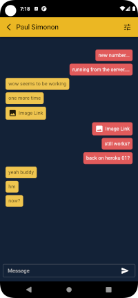
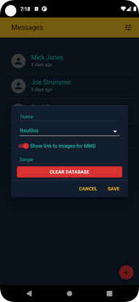
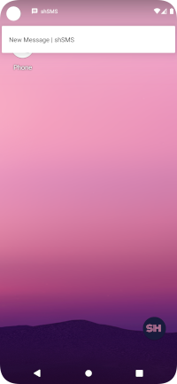

# shSMS

An app designed to run as a native application on the Android operating system and allow you to communicate via SMS.

**Please note:** This app makes several assumptions about you as a user. First and foremost, it assumes you are following the steps in Chapter Two \(p.33\) of Michael Bazzell's Book "Extreme Privacy: What It Takes To Disappear \(Third Edition\)". By that assumption, it is assumed that you have a Google Pixel device running GrapheneOS, a Twilio account with at least one phone number and access to a computer with Linux installed.

#### What this app is not:

* shSMS is NOT an end to end encrypted messaging service. Yes, the messages are stored on your personal database and you have full control over those, but the person you're communicating with, \(presumably\) is using a standard mobile device with a "traditional" cellular service provider, ie: AT&T, Verizon, etc. There is absolutely nothing that can be done to stop those providers from storing your data. Just a fact of life we all have to deal with.
* shSMS is not intended to be 100% private, even on your end \(depending on how you host\). Your messages go through Twilio. You can delete them, but still, they must go through Twilio servers at some point in order to get to you. Think of it as a tool to help you stay more _anonymous_
* If you choose to host your server on Heroku: Heroku is now owned by Salesforce. Salesforce is a beast when it comes to data. Assume they have _everything_ that comes through their servers and are using it.
* If you choose to host your database on mLab \(mongodb\) your data is also in their hands. And they give you the option to use servers owned by Amazon, Google or Microsoft. Sooo there's also that. We can encrypt our entries before they go in to the database \(to be implemented soon\), but the fact remains that even though we're "self-hosting" away from the major providers, we're still depending on someone else to hold on to our information.

#### Now tell me what it can do

* Send and receive SMS \(text messages\) with people who are using a standard mobile device.
* Send and receive MMS \(Multimedia Messaging Service\) with people who are using a standard mobile device.
* Recieve push notifications when a new message is received. An alert will show and the device will vibrate and/or chime when a new message is recieved just like you would expect, but without any Google services.
* Run on any computer locally \(not hosted publically on the internet\) and have the same functionality as the native Android app with updates in real-time.
* Switch themes. Because, we can I guess...
* Receive/send messages from multiple phone numbers with a single instance of the app across all devices.
* Import device contacts \(read only\) and send message.

   

**Note:** I took those screenshots on the emulator and I couldn't get one of the notification appearing on the lock screen, but it does turn on the screen and appear on the actual device when the phone is on and the screen is locked. Also, the screenshots above do not show multiple phone numbers, since the ability to rename the numbers is not implemented yet it's tricky to get an image without having to have a black box around several parts of the image. And that doesn't look cool.

