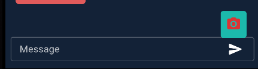
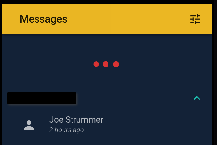
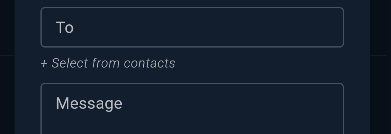

# Using shSMS

I figured it might be useful to include a couple things here that might not be obvious to a first time user

### Send Pictures

You can toggle the MMS/photo feature by holding down the "Send" button in any message

If you're on a computer it will open the file picker and you can select an image to send. For the native app, it will prompt you with the native menu asking if you want to add a photo from your Gallery or use the camera. You may be prompted with a permissions dialog before the app is allowed to access these features. Only one picture may be sent at a time for now. The next release should include multiple images to be selected.

Note: While the app is only set up for images, it is possible to send other media types with this method, but they have not been tested, like, at all. So do so at your own risk. Doing this may cause the app to crash. If this happens, a simple restart should fix it, but like I said, it hasn't been tested thoroughly yet.

### Refresh

On the main screen \(contacts\) you can 'pull down' to manually reload the data from the backend. 

This is useful especially when hosting on Heroku and the server goes to sleep due to inactivity.

### Sending to saved contacts

In the New Message dialog, you can click "+ Select from contacts" to send a message from a number saved on your device.

You may be required to allow access to use this feature. Also note! There may be a bug that appears when doing this for the first time. If you allow access and you don't see your contacts in the dropdown that appears, exit the app completely and re-open it. I believe this is caused by the app not refreshing it's state after allowing access through the native modal. This is being looked in to and should have an update soon.

**VERY IMPORTANT:** If you are planning on using this feature, the phone number of the contact MUST be saved in the native Contacts app with a plus \(+\) and the country code!! This feature will not work if the contact's phone number is not in that format. At the time of writing this there is nothing I can really do about that without restricting the use of this feature to certain countries. This is caused by 1. The way Android stores the numbers in the device. 2. The format we need to send the number to Twilio. I will look in to this more, but for now, MAKE SURE YOU FORMAT THE NUMBER PROPERLY 😑

### Using multiple phone numbers

The use of communicating via multiple phone numbers is built in to shSMS. As long as you've set up the number in Twilio to use the function \(created in step 04\) to pass the message to your server, everything should automatically be added when a new SMS comes in. If you've added the function to your number in Twilio, but want to send a message from that number before you receive an incoming SMS, open the New Message dialog and enter your number in the From textfield manually. If Twilio is set up, the message will be sent and the new number will be added to your list.

